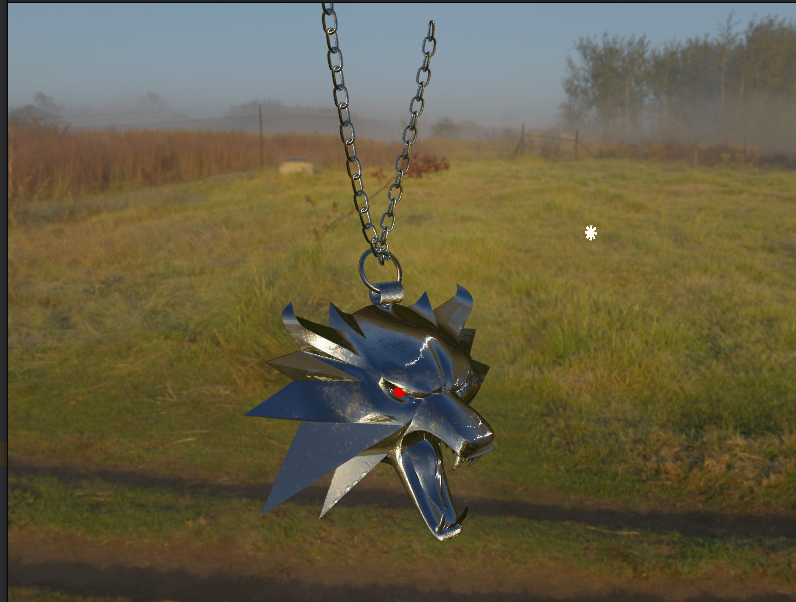

# Pablo rendering engine

As title suggests Pablo is a rendering engine that supports PBR materials and 3D models together with 
**Image based lightning**

This rendering engine serves a purpose of learning hwo does PBR workflow works.
Hence the code is messy and does not follow best principles yet. 

Rendering engine capabilities are demonstrated here:

