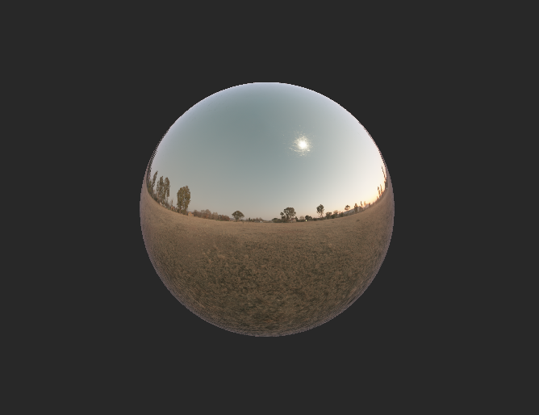
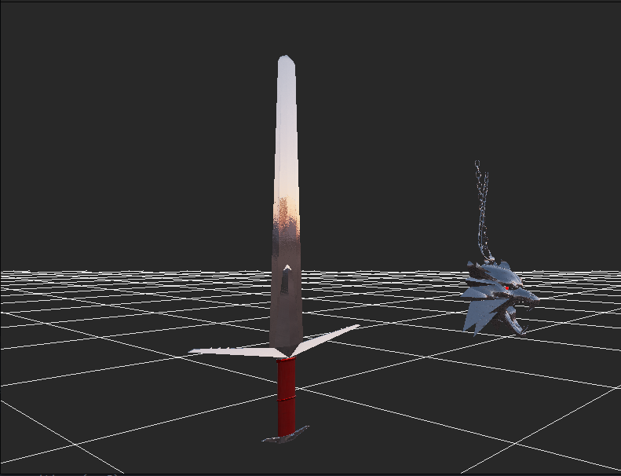
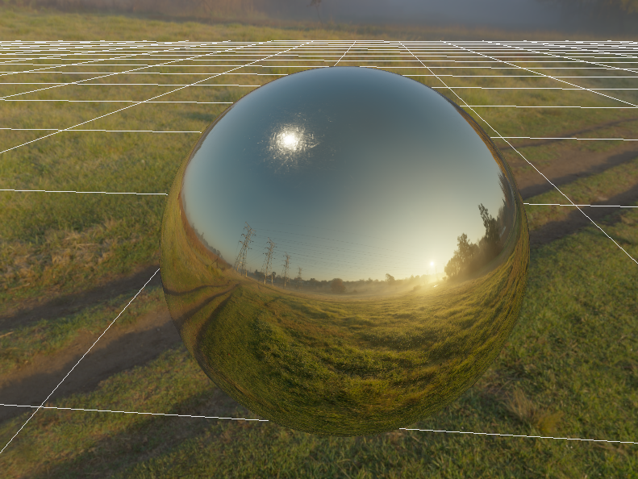
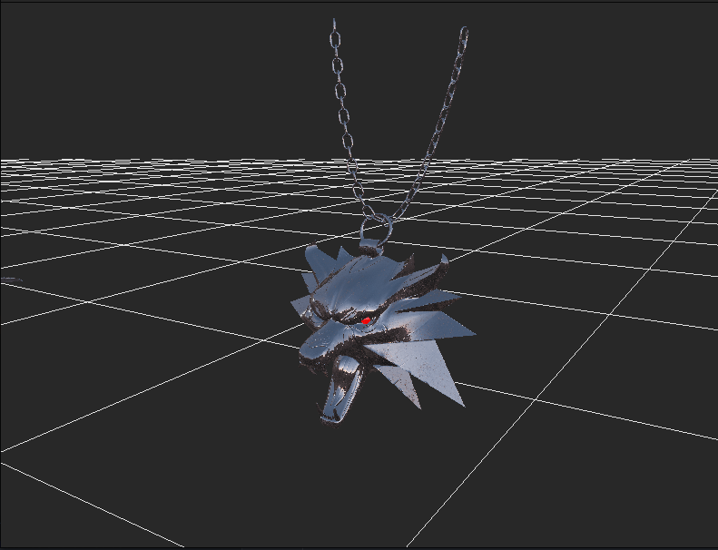

# Pablo rendering engine

As title suggests Pablo is a rendering engine that supports PBR materials and 3D models together with 
**Image based lightning**

It provides fast and convenient way of rendering various geometry with different materials 

This renderer is build using 

**[GLFW](https://www.glfw.org)** for window management

**[GLM](https://glm.g-truc.net/0.9.9/index.html)** for mathematics 

**[GLAD](https://glad.dav1d.de)** for OpenGL functions initialization

**[Assimp](https://assimp-docs.readthedocs.io/en/v5.3.0/)** for model loading

# Features 

- PBR shaders
- IBL (Image based lighting)
- Model loaders 
- Support for Normal mapping using normal maps in tangent space
- Anti aliasing up to 16x pixel samples
- Instance rendering 
- Transparent grid
- SkyBox
- Debug view for textures or frame buffer textures
- Flexible class structure
- SceneGraph design pattern

----

# Example
To create sphere using IBL within the framework the code would look like this

```c++
auto iblPipeLine = std::make_shared<IBLPipeLine>("Assets/Textures/HDR/sunset.hdr");
iblPipeLine->generateIBLTextures();

//Create geometry
auto sphereGeometry = std::make_shared<SphereGeometry>();

//Create material
auto goldMaterial = std::make_shared<PBRTextured>(PBRTexutreShader, "Assets/Textures/PBR/Gold");

//Create renderable
auto sphereRenderable = std::make_unique<Renderable>(sphereGeometry, goldMaterial);

//createScene
auto scene = std::make_shared<Scene>();
scene->setIblPipeLine(iblPipeLine);

scene->add(std::move(sphereRenderable));

PabloRenderer pabloRenderer(scene, window);
pabloRenderer.init();
    
pabloRenderer.render();
```

The result of the snippet will look like this 



As of now renderer's shader only support one directional light which is going to change in the near future

# Images


----



----


