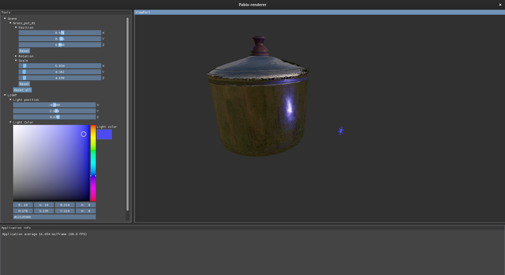
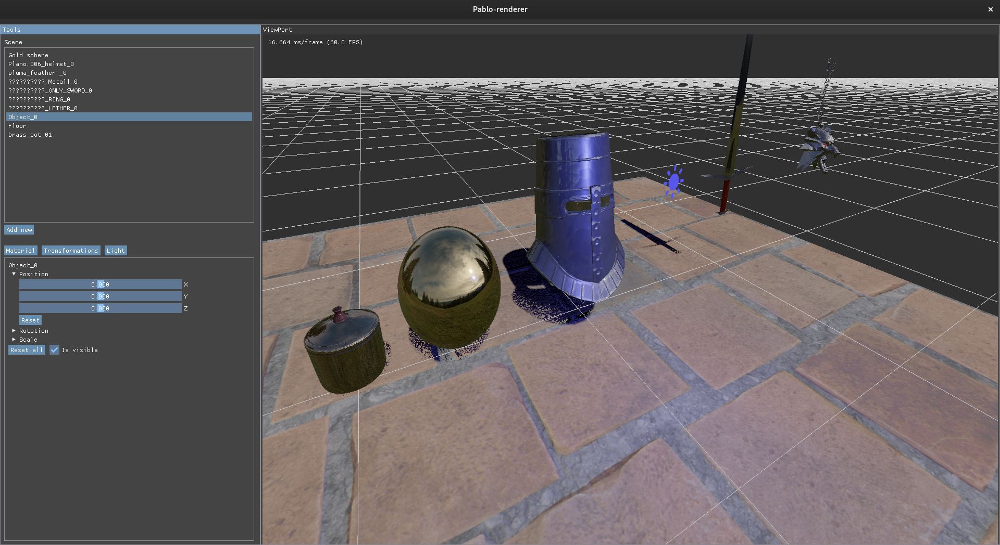
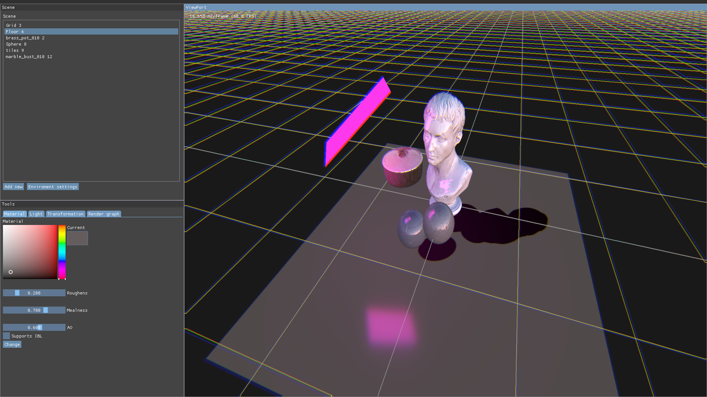
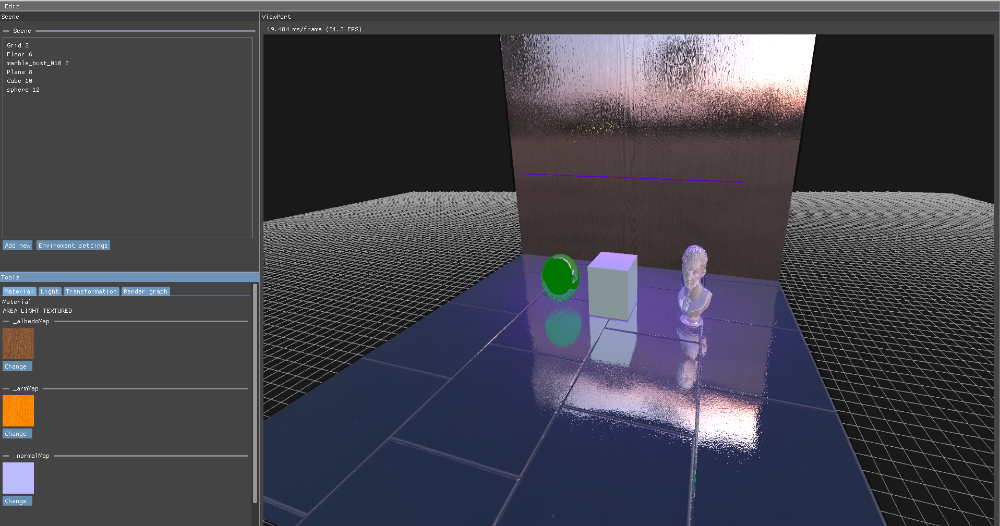

# Pablo rendering engine

As title suggests Pablo is a rendering engine and OpenGL abstraction framework that supports PBR materials and 3D models together with 
Image based lightning, Screen Space Reflections and more.

It provides fast and convenient way of rendering various geometry with different materials 

This renderer is build using 

**[GLFW](https://www.glfw.org)** for window management

**[GLM](https://glm.g-truc.net/0.9.9/index.html)** for mathematics 

**[GLAD](https://glad.dav1d.de)** for OpenGL functions initialization

**[Assimp](https://assimp-docs.readthedocs.io/en/v5.3.0/)** for model parsing

**[Dear imgui](https://github.com/ocornut/imgui)** for UI


# Features 

- PBR shaders
- IBL (Image based lighting)
- Screen space reflection using real time ray marching 
- Model loaders 
- Support for Normal mapping using normal maps in tangent space
- Anti aliasing
- Transparent grid
- SkyBox
- Pixel picking
- Debug view for textures or frame buffer textures
- Flexible class structure
- SceneGraph design pattern
- Orbit camera
- Shadow mapping
- UI editor
- Model Loading from UI
- Area lights with LTCs (Linearly transform cosines)
- Screenshots of different render passes
- Realtime change of Attached materials
----

# Example
To create sphere using IBL within the framework the code would look like this

```c++

//create an instance of PabloRenderer
auto pabloRenderer = PabloRenderer::getInstance();
pabloRenderer->init();

//create and run IBL pipeline
auto iblPipeLine = std::make_shared<IBLPipeLine>("Assets/Textures/HDR/hill.hdr");
iblPipeLine->generateIBLTextures();

//load model 
auto pot = std::make_unique<ModelSceneNode>("Assets/Model/pot/brass_pot_01_2k.gltf");
pot->transformation->setScale(4.0f, 4.0f, 4.0f);
pot->castsShadow(true);

//create scene
std::shared_ptr<Scene> scene = std::make_shared<Scene>();

//attach IBL pipeline to have image based lightning
scene->setIblPipeLine(iblPipeLine);

//attach scene to the PabloRenderer
pabloRenderer->attachScene(scene);

//render the attached scene
pabloRenderer->render();
```

The result of the snippet will look like this (after small alterations using UI)

Or we can simply do it via UI by clicking `Add new` button and following instructions on the screen




# Images






# Video

[pablo-showcase.webm](https://github.com/wpsimon09/Pablo-Renderer/assets/95319163/856c0591-6892-4c1b-8b06-fc91c60da89c)

# Note
development of Pablo has ended as I plan to rewrite it using Vulkan and use different structure of the code which would be quite difficult to implement in this code base

Pablo Renderer will return 


