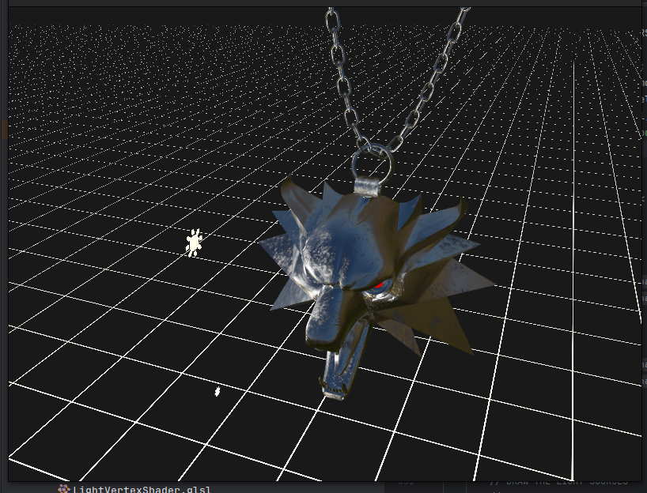
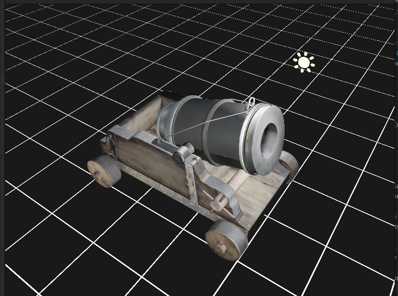
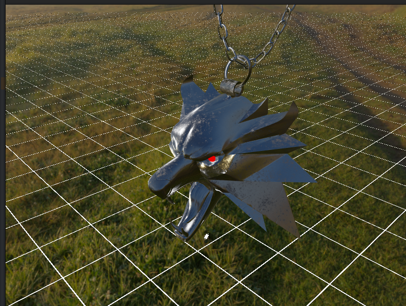

# Pablo rendering engine

As title suggests Pablo is a rendering engine that supports PBR materials and 3D models together with 
**Image based lightning**

This rendering engine serves a purpose of learning hwo does PBR workflow works.
Hence the code is messy and does not follow best principles yet. 

This renderer is build using 

**[GLFW](https://www.glfw.org)** for window management

**[GLM](https://glm.g-truc.net/0.9.9/index.html)** for mathematics 

**[GLAD](https://glad.dav1d.de)** for OpenGL functions initialization

**[Assimp](https://assimp-docs.readthedocs.io/en/v5.3.0/)** for model loading

# Features 

- PBR shaders
- IBL (Image based lighting)
- Model loaders 
- Support for Normal mapping using normal maps in tangent space
- Anti aliasing up to 16x pixel samples
- Instance rendering 
- Transparent grid
- SkyBox
- Debug view for textures or frame buffer textures
- Flexible class structure
- SceneGraph design pattern

----

# Images

----

----

